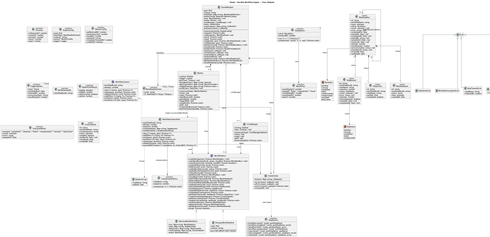
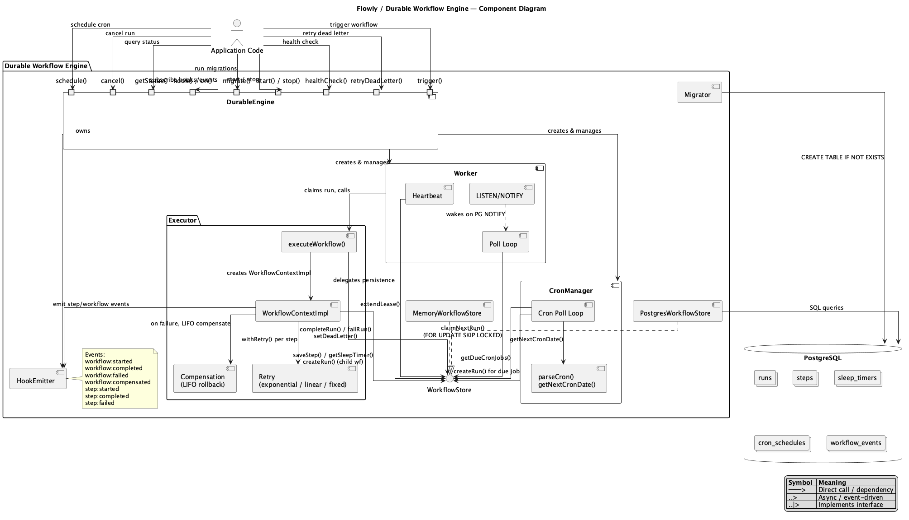
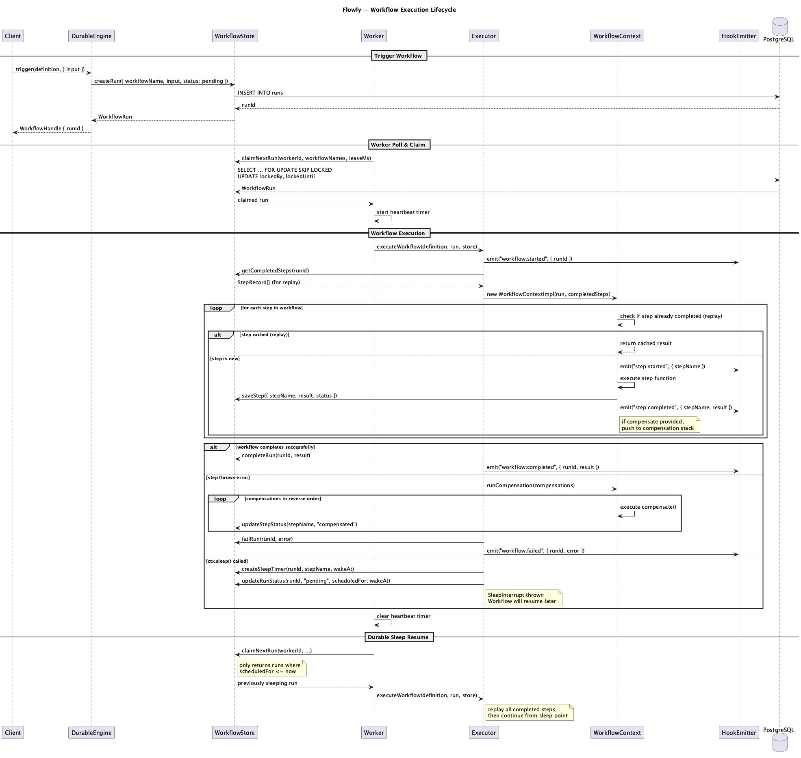

<p align="center">
<h1 align="center">flowly</h1>
<p align="center">Durable workflow engine for TypeScript, backed by Postgres.<br/>Define workflows as async functions. Steps persist. Crashes recover.</p>
</p>

<p align="center">
  <a href="#features">Features</a> |
  <a href="#install">Install</a> |
  <a href="#quick-start">Quick Start</a> |
  <a href="#api">API</a> |
  <a href="#scheduling">Scheduling</a> |
  <a href="#how-it-works">How It Works</a> |
  <a href="#database-schema">Database Schema</a> |
  <a href="#testing">Testing</a> |
  <a href="#architecture">Architecture</a> |
  <a href="#license">License</a>
</p>

---

## Table of Contents

- [Features](#features)
- [Install](#install)
- [Quick Start](#quick-start)
- [API](#api)
  - [defineWorkflow](#defineworkflowname-fn)
  - [WorkflowContext](#workflowcontext)
  - [StepOptions](#stepoptions)
  - [DurableEngine](#durableengine)
- [Scheduling](#scheduling)
- [How It Works](#how-it-works)
  - [Step Persistence and Replay](#step-persistence--replay)
  - [Compensation (Sagas)](#compensation-sagas)
  - [Durable Sleep](#durable-sleep)
  - [Concurrency](#concurrency)
  - [Crash Recovery](#crash-recovery)
- [Database Schema](#database-schema)
- [Testing](#testing)
- [Architecture](#architecture)
- [License](#license)

---

## Features

- **Workflows as functions.** No DSL, no YAML, no framework to learn.
- **Step persistence.** Completed steps are saved and replayed on resume.
- **Retries.** Configurable per step with exponential, linear, or fixed backoff.
- **Compensation (sagas).** Automatic rollback of completed steps on failure.
- **Durable sleep.** `ctx.sleep()` survives process restarts.
- **Cron scheduling.** Recurring workflows via cron expressions.
- **Concurrent workers.** Multiple workers with lease-based locking and `FOR UPDATE SKIP LOCKED`.
- **Zero infrastructure.** Just Postgres. No separate server or message broker.

---

## Install

```bash
npm install github:elliot736/flowly pg
```

---

## Quick Start

```ts
import { defineWorkflow, DurableEngine } from "flowly";
import pg from "pg";

// Define a workflow
const orderWorkflow = defineWorkflow(
  "process-order",
  async (ctx, input: { orderId: string; amount: number }) => {
    // Each step is persisted. On resume, completed steps return saved results.
    const reserved = await ctx.step("reserve-inventory", {
      run: () => inventoryService.reserve(input.orderId),
      compensate: (result) => inventoryService.release(result.reservationId),
      retry: { maxAttempts: 3, backoff: "exponential", initialDelayMs: 500 },
    });

    // Durable sleep: process can restart, timer survives
    await ctx.sleep("cooling-period", { seconds: 30 });

    const charged = await ctx.step("charge-payment", {
      run: () => paymentService.charge(input.amount),
      compensate: (result) => paymentService.refund(result.chargeId),
    });

    await ctx.step("send-confirmation", {
      run: () => emailService.send(input.orderId, charged.receiptUrl),
    });

    return { orderId: input.orderId, receiptUrl: charged.receiptUrl };
  },
);

// Boot the engine
const engine = new DurableEngine({
  pool: new pg.Pool({ connectionString: process.env.DATABASE_URL }),
  workflows: [orderWorkflow],
});

await engine.migrate(); // creates tables
await engine.start(); // starts polling

// Trigger a workflow
const handle = await engine.trigger(orderWorkflow, {
  input: { orderId: "ord_123", amount: 9900 },
});

// Check status
const status = await engine.getStatus(handle.workflowRunId);

// Graceful shutdown
await engine.stop();
```

---

## API

### `defineWorkflow(name, fn)`

Creates a workflow definition. The function receives a `WorkflowContext` and the input.

### `WorkflowContext`

| Method                       | Description                                              |
| ---------------------------- | -------------------------------------------------------- |
| `ctx.step(name, opts)`       | Execute a named step. On replay, returns the saved result. |
| `ctx.sleep(name, duration)`  | Pause for a duration. Durable, survives restarts.        |
| `ctx.sleepUntil(name, date)` | Pause until a specific timestamp.                        |
| `ctx.workflowRunId`          | The unique ID of this workflow run.                      |
| `ctx.attempt`                | Current attempt number (starts at 1).                    |

### `StepOptions`

```ts
{
  run: () => T | Promise<T>;                    // The function to execute
  compensate?: (result: T) => void | Promise<void>;  // Rollback on failure
  retry?: {
    maxAttempts?: number;       // default: 1
    backoff?: "fixed" | "exponential" | "linear";
    initialDelayMs?: number;    // default: 1000
    maxDelayMs?: number;        // default: 30000
    factor?: number;            // default: 2
  };
  timeoutMs?: number;           // per-step timeout
}
```

### `DurableEngine`

```ts
const engine = new DurableEngine({
  pool: pg.Pool,                  // your Postgres pool
  workflows: WorkflowDefinition[],
  schema?: string,                // default: "durable_workflow"
  worker?: {
    pollIntervalMs?: number,      // default: 1000
    maxConcurrent?: number,       // default: 5
    leaseMs?: number,             // default: 30000
    workerId?: string,            // default: auto-generated
  },
});
```

| Method                            | Description                                         |
| --------------------------------- | --------------------------------------------------- |
| `engine.migrate()`                | Create schema and tables (idempotent).              |
| `engine.start()`                  | Start the worker and cron manager.                  |
| `engine.stop()`                   | Graceful shutdown. Waits for in-flight workflows.   |
| `engine.trigger(workflow, opts)`  | Start a workflow. Returns `{ workflowRunId }`.      |
| `engine.schedule(workflow, opts)` | Set up a recurring workflow with a cron expression. |
| `engine.getStatus(runId)`         | Get the current status of a workflow run.           |

---

## Scheduling

```ts
// Delayed execution
await engine.trigger(orderWorkflow, {
  input: { orderId: "ord_456", amount: 4900 },
  scheduledFor: new Date("2026-04-01T00:00:00Z"),
});

// Recurring via cron
await engine.schedule(orderWorkflow, {
  cron: "0 9 * * 1", // every Monday at 9am
  input: { orderId: "weekly-batch", amount: 0 },
});
```

---

## How It Works

### Step Persistence & Replay

When a workflow runs, each `ctx.step()` call saves its result to Postgres. If the process crashes and the workflow is re-executed, completed steps return their saved results without re-running.

### Compensation (Sagas)

If a step fails after retries are exhausted, previously completed steps are compensated in reverse order:

```
step-1 completed -> step-2 completed -> step-3 failed
                                            |
                                  compensate step-2
                                  compensate step-1
```

### Durable Sleep

`ctx.sleep()` persists a timer to Postgres, then releases the workflow. The worker picks it up again after the timer expires. Sleep survives process restarts.

### Concurrency

Multiple workers can run simultaneously. Work is distributed via `FOR UPDATE SKIP LOCKED`. No advisory locks, no contention. Each worker holds a lease that it extends with heartbeats.

### Crash Recovery

If a worker crashes mid-step:

1. The step result was never saved (incomplete).
2. The lease expires after 30 seconds.
3. Another worker picks up the workflow.
4. Completed steps are replayed, the incomplete step re-executes.

Steps should be idempotent or use external idempotency keys.

---

## Database Schema

Four tables in a configurable schema (default `durable_workflow`):

- `workflow_runs` stores workflow state, input, result, and locking info.
- `workflow_steps` stores per-step results and status.
- `sleep_timers` stores durable sleep state.
- `cron_schedules` stores recurring workflow configuration.

---

## Testing

```bash
# Unit tests (no Postgres required)
npm test

# Integration tests (requires Docker)
npm run test:integration
```

The library exports `MemoryWorkflowStore` for testing workflows without Postgres:

```ts
import { MemoryWorkflowStore } from "flowly";

const store = new MemoryWorkflowStore();
engine.setStore(store);
```

---

## Architecture

### Class Diagram



### Component Diagram



### Sequence Diagram



---

## License

MIT
